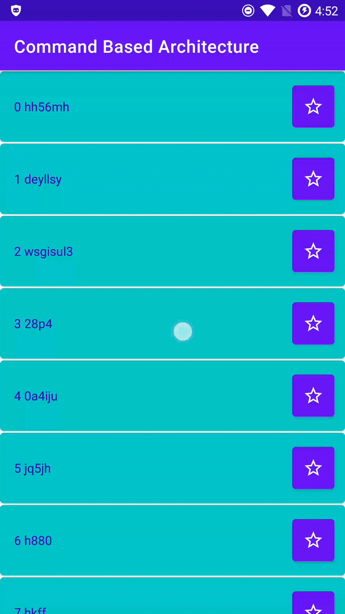

<h1 align="center">Command Based Architecture for Android</h1>

<p align="center">
  Process concurrent tasks on data sources
</p>

&nbsp;

## Features

This is an Android Command Based Architecture for processing concurrent tasks (commands) on single or multiple data sources. This library supports the execution and synchronization of different tasks on multiple threads.

Key features in flow control:
1. Ability to control if a task should be executed or skipped based on current data (screen) state.
2. Ability to control if a task should be executed immediately or delayed based on current data (screen) state.
3. Ability to block/postpone other tasks during task execution.

Key features in data change:
Each task has its own lifecycle:
1. After command was added to the queue - `onCommandWasAdded`
2. Immediately before command execution - `onExecuteStarting`
3. Immediately after successful execution - `onExecuteSuccess`
4. Immediately after failed execution - `onExecuteFail`
5. Final step of execution (called on any success or fail) - `onExecuteFinished`

## Integration with Gradle

For coroutine implementation:
```
    implementation 'io.scal:commandbasedarchitecture_coroutine:version'
```

Please replace `version` with the latest version: [](https://bintray.com/mig35/android-maven/command-based-architecture-coroutine/_latestVersion)


For RxJava implementation:
```
    implementation 'io.scal:commandbasedarchitecture_rxjava:version'
```

Please replace `version` with the latest version: [](https://bintray.com/mig35/android-maven/command-based-architecture-rxjava/_latestVersion)


## How to use

Please find the full description in [the post](https://scal.io/blog/command-based-architecture).

Basic Setup:
1. Create an instance of CommandManager: `val commandManager: CommandManager<ScreenState> by lazy { CommandManagerImpl(mutableScreenState, viewModelScope) }`
2. Use an existing or create a custom command (RefreshCommand, LoadNextCommand).
    a. Implement execution strategy directly in the command (ExecutionStrategy class)
    b. Implement data side effects during command lifecycle
3. Add command to execution queue by calling `commandManager.postCommand(yourCommand)`

By default, the CommandManager uses `Dispatchers.Main` for execution, so you will need to switch to an appropriate Dispatcher if you require more complex logic.


## Customizations

TBD


## Example



#### Contact ####

Feel free to reach out to me.

    Website:    https://scal.io
    LinkedIn:   https://www.linkedin.com/company/scalio/
    LinkedIn:   https://www.linkedin.com/in/mig35/
    Email:      mikhail@scal.io
    Email:      mig35@mig35.com

#### License ####

    Licensed under the Apache License, Version 2.0 (the "License");
    you may not use this file except in compliance with the License.
    You may obtain a copy of the License at

       http://www.apache.org/licenses/LICENSE-2.0

    Unless required by applicable law or agreed to in writing, software
    distributed under the License is distributed on an "AS IS" BASIS,
    WITHOUT WARRANTIES OR CONDITIONS OF ANY KIND, either express or implied.
    See the License for the specific language governing permissions and
    limitations under the License.
